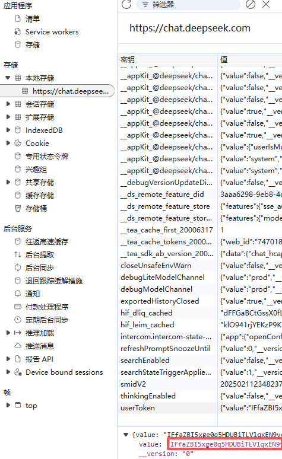
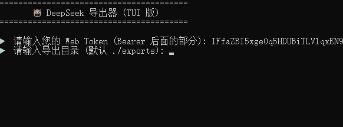
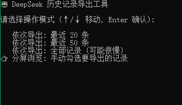
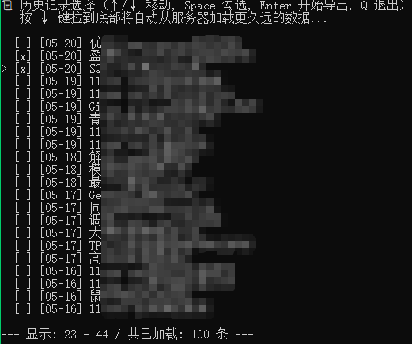
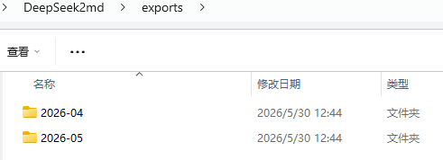

# DeepSeek2md 历史对话导出markdown

[](https://go.dev)
[](LICENSE)

这是一个基于终端界面 (TUI) 的 **DeepSeek 历史对话导出工具**，支持智能分页、按需加载、精准选择以及本地排重导出，完美解决 DeepSeek 历史记录备份及再利用的问题。

导出的MarkDown文件，便于利用笔记软件，如obsidian，整理、管理。

## 🚀 核心功能

* **智能交互界面**：基于 [Bubbletea](https://github.com/charmbracelet/bubbletea) 的全屏 TUI，支持键盘交互。
* **按需加载 (Lazy Loading)**：分批加载历史对话，平滑浏览及获取。
* **灵活导出**：支持“最近导出”、“全部导出”以及“手动勾选导出”。
* **智能排重**：内置本地文件系统检查，已存在对话自动跳过，节省 API 请求次数。
* **自动格式化**：深度优化 Markdown 排版，完美还原 DeepSeek 的“深度思考”过程和普通聊天内容。
* **跨平台支持**： Windows, macOS, Linux (amd64/arm64)。

## 版本历史

#### 202605

- 重构，增加TUI（终端引导界面）。
- 不再依赖deepseek的导出文件，从浏览器获取token后直接获取历史记录。
- 更加灵活的导出选项。

#### 202601

- 在桌面网页端DeepSeek官网中，点击 系统设置

- 点击 数据管理，点击 导出所有历史对话

- 解压文件

- 将 conversations.json 拖放到本程序上，或者cmd终端执行。

- Markdown文件以“日期+对话标题”为文件名。

- Markdown文件按月份分组存储在“conversations_export”文件夹下。
-  Python版本由用户 [woshicby](https://github.com/woshicby) 提供的等效Python实现，适用于未安装Go环境的用户。


## 🛠️ 快速开始


### 使用

1. 获取你的 DeepSeek Web Token：
   * 在浏览器登录 [chat.deepseek.com](https://chat.deepseek.com)
   * 按 `F12` 打开开发者工具，切换到 **Network (网络)** 标签。<br>
   
   
   * 截图中圈出的userToken 后面的value内容即为 Token。<br>
   

   * 部分导出、全部导出、手动选择<br>
   

   * 可以分页手动选择，空格选择、回车完成选择<br>
   

   * 回车后导出所选记录<br>
   
   

   * 按键盘“Q”键退出

### 构建与运行

- 下载运行预编译二进制文件
- 本地编译

```bash
# 克隆项目
git clone [https://github.com/DavidShiang/DeepSeek2md](https://github.com/DavidShiang/DeepSeek2md.git)
cd DeepSeek2md

# 安装依赖并运行
go mod tidy
go run .
```


## 📈 项目流量统计

---


> 数据每日自动更新。完整历史记录请查看 [traffic_history.csv](https://raw.githubusercontent.com/DavidShiang/davidshiang-metrics-data/main/DeepSeek2md_traffic_history.csv)。
